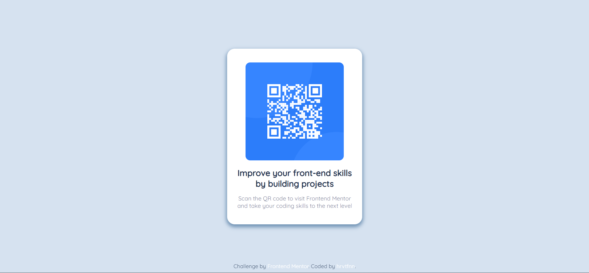

# Frontend Mentor - QR code component solution

This is a solution to the [QR code component challenge on Frontend Mentor](https://www.frontendmentor.io/challenges/qr-code-component-iux_sIO_H). Frontend Mentor challenges help you improve your coding skills by building realistic projects. 

## Table of contents

- [Overview](#overview)
  - [Screenshot](#screenshot)
  - [Links](#links)
- [My process](#my-process)
  - [Built with](#built-with)
  - [Continued development](#continued-development)
  - [Useful resources](#useful-resources)
- [Author](#author)

## Overview

### Screenshot

### Links

- Solution URL: (https://github.com/hrvtfnn/QR-Code-Challenge)
- Live Site URL: (https://hrvtfnn.github.io/QR-Code-Challenge/)

### Built with

- Semantic HTML5 markup
- CSS custom properties
- Flexbox

### Continued development

I would like to use this template in my portfolio website.

### Useful resources

- [def] - This helped me with flexbox.

[def]: https://flexboxfroggy.com/

## Author

- Frontend Mentor - [@hrvtfnn](https://www.frontendmentor.io/profile/hrvtfnn)
- GitHub - [@hrvtfnn](https://github.com/hrvtfnn)